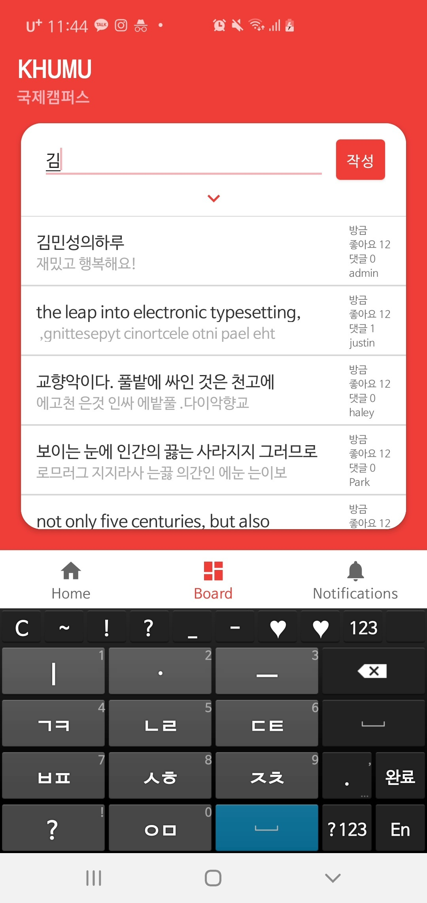

# khumu-android

khumu 프로젝트의 안드로이드 레포지토리.

## 개발 시 주의사항

* Adapter에 반응은 하는데 UI 업데이트는 제대로 이루어지지않거나 Observer가 onChanged에서 이벤트를 다 받지 못하는 경우
  * Adapter가 ListView나 RecyclerView에 제대로 Adapter로 등록되지 않았을 수 있다.

* ViewModel의 LiveData가 변경되어도 Observer가 이벤트를 감지할 수 없는 경우.
  * Observer가 Listen 중인 ViewModel의 LiveData가 아닌 다른 ViewModel의 LiveData를 조작하는 경우 동일한 LiveData를 이용하지 않기 때문임.

    ViewModel을 올바르게 생성하거나 전달받지 못한 경우 이런 현상이 발생.